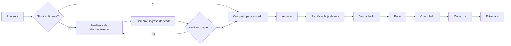

# Corte operativo y testing - v25

Fecha del corte: 2026-06-29
Objetivo: llegar al piloto del miercoles 2026-07-01 con un sistema estable, documentado y probado en un circuito controlado.

## Version activa

- Servidor: `SERVIDOR_UNICO_8790`
- Puerto: `8790`
- URL local: `http://127.0.0.1:8790/index.html#dashboard`
- Health local: `http://127.0.0.1:8790/api/health`
- Carpeta activa: `C:\DistribuidoraLopez\release\DLPreventaServer-UNICO-8790-2026-06-29-v25-ABASTECIMIENTO-AUTO`
- Paquete base: `C:\DistribuidoraLopez\release\DLPreventaServer-UNICO-8790-2026-06-29-v25-ABASTECIMIENTO-AUTO.zip`

## Resumen ejecutivo

El sistema ya cubre el nucleo operativo: preventa, reserva de stock, faltantes, abastecimiento, armado, hoja de ruta, reparto y cobranza. La v25 corrigio el punto critico de abastecimiento: cuando se carga stock nuevo, los pedidos pendientes se revisan automaticamente y pasan a "Completo para armado" si ya tienen mercaderia suficiente.

Para el piloto del miercoles conviene trabajar con alcance controlado: un administrador, un preventista o Kevin, un dispositivo de reparto y una seleccion corta de clientes geolocalizados. No conviene habilitar toda la operatoria real hasta cerrar las alertas de saldo pendiente, la obligatoriedad de foto de transferencia y la geolocalizacion minima de clientes.

## Semaforo por tema de la minuta

| Tema | Estado | Que esta hecho | Que falta |
| --- | --- | --- | --- |
| Preventa y stock | Hecho | El pedido entra por preventa. Si no hay stock suficiente queda en "Pendiente de abastecimiento". Al ingresar stock se autoasigna y pasa a "Completo para armado". | Prueba real con pedido de Kevin y reposicion fisica. |
| Saldo pendiente | Parcial | El sistema registra saldo pendiente al cobrar como cuenta corriente/saldo pendiente y actualiza el cliente. | Alerta formal a administracion antes de autorizar nuevos pedidos de clientes con deuda. |
| Reparto y cobranza | Parcial avanzado | Hay hojas de ruta, estados de reparto, GPS, firma, cobro en efectivo, transferencia y saldo pendiente. | Ajustar el lenguaje a "Fiado / saldo pendiente" y cerrar reglas finales de uso. |
| Transferencias | Parcial | El sistema permite subir comprobantes/fotos como adjuntos. | Hacer obligatoria la foto cuando la forma de cobro es transferencia. Crear carpeta diaria y tablero de conciliacion bancaria. |
| Armado de pedidos | Parcial | El panel de pedidos permite avanzar estados e imprimir hoja de deposito. | Mesa digital de armado con control por producto/cantidad, pantalla o tablet y futuro scanner. |
| Etiquetas | Pendiente | Hay definicion conceptual. | Crear formato imprimible: cliente, direccion, pedido, bultos, zona/ruta. |
| Hoja de ruta | Parcial | Existe planificacion de rutas, ordenamiento y envio a reparto. | Completar geolocalizacion real de clientes; marcar en rojo clientes sin direccion valida. |
| Estados del pedido | Hecho con ajuste pendiente | Flujo actual operativo: Preventa, Pendiente de abastecimiento, Completo para armado, Armado, Despachado, Bajar, Controlado, Entregado. | Simplificar vista para usuario final y definir si "Cobrado" queda como estado o como dato de cobranza. |

## Flujo recomendado para el cliente



## Regla clave de abastecimiento

No se modifica manualmente el stock para vender mercaderia que no existe fisicamente. Si falta mercaderia, el pedido queda registrado y visible como pendiente. Cuando el producto ingresa, el sistema intenta completar pedidos pendientes en orden operativo.

Esto evita diferencias de stock y mantiene trazabilidad de:

- cantidad pedida;
- cantidad reservada;
- cantidad faltante;
- ingreso de mercaderia;
- cambio automatico de estado.

## Pendientes P0 antes del piloto ampliado

1. Validar que un pedido sin stock pase a "Pendiente de abastecimiento".
2. Validar que el ingreso de stock cambie automaticamente el pedido a "Completo para armado".
3. Hacer obligatoria la foto del comprobante cuando la cobranza sea por transferencia.
4. Agregar alerta administrativa para cliente con saldo pendiente.
5. Cargar coordenadas reales de los clientes que se usaran en la prueba.
6. Confirmar impresora para hoja de deposito y, si aplica, prueba de impresion.

## Pendientes P1 para la semana siguiente

1. Carpeta diaria de comprobantes de transferencia.
2. Panel de conciliacion bancaria contra comprobantes.
3. Etiqueta de bulto.
4. Mesa de armado en tablet/pantalla.
5. Scanner de codigo de barras para control de entrada y despacho.
6. Reporte de diferencias de stock y auditoria.

## Checklist tecnico rapido

Ejecutar desde PowerShell:

```powershell
cd C:\DistribuidoraLopez\SERVIDOR_UNICO_8790
powershell.exe -ExecutionPolicy Bypass -File .\scripts\smoke-v25.ps1
```

Debe confirmar:

- servidor responde en `/api/health`;
- version visual v25 disponible;
- archivos JavaScript sin errores de sintaxis;
- motor de abastecimiento autoasigna stock pendiente.

## Checklist funcional para el miercoles

1. Abrir dashboard local y verificar login admin.
2. Abrir desde celular por Tailscale y verificar login vendedor.
3. Crear pedido con stock suficiente.
4. Confirmar que queda "Completo para armado".
5. Crear pedido con stock insuficiente.
6. Confirmar que queda "Pendiente de abastecimiento".
7. Entrar a Stock y cargar ingreso del producto faltante.
8. Confirmar que el pedido cambia a "Completo para armado".
9. Abrir "Compras pendientes" y verificar si quedan faltantes.
10. Avanzar pedido a "Armado".
11. Planificar hoja de ruta desde administracion.
12. Publicar ruta a un dispositivo de reparto.
13. En reparto: abrir "Ir al cliente".
14. Marcar "Bajar".
15. Marcar "Controlado".
16. Cobrar efectivo y cerrar entrega.
17. Repetir con transferencia y verificar foto de comprobante.
18. Repetir con fiado/saldo pendiente y verificar saldo del cliente.
19. Revisar trazabilidad completa del pedido.
20. Imprimir hoja de deposito si la impresora esta disponible.

## Criterio de aprobacion del piloto

El piloto se considera aprobado si:

- el pedido se carga desde celular;
- el pedido aparece en administracion sin refrescos manuales excesivos;
- el stock se descuenta/reserva correctamente;
- el faltante genera abastecimiento;
- el ingreso de stock libera el pedido;
- administracion puede armar ruta;
- reparto puede navegar, bajar, controlar y entregar;
- la cobranza queda registrada con forma de pago, importe, fecha, usuario y GPS.

## Riesgos conocidos

- Si el celular no entra por Tailscale, revisar que este conectado a la red Tailnet correcta y usar HTTP, no HTTPS, salvo que haya certificado configurado.
- Si GPS falla en navegador, Android exige origen seguro. La APK nativa debe usar permisos de ubicacion y URL del servidor correcta.
- Si hay clientes sin direccion o coordenadas, la ruta no se puede optimizar de forma confiable.
- Si se aceptan transferencias sin foto obligatoria, administracion pierde control sobre comprobantes falsos o rechazados.
- Si el cliente tiene saldo pendiente y no hay alerta de autorizacion, el preventista puede seguir cargando pedidos sin control administrativo.

## Recomendacion de salida

Para el miercoles 2026-07-01 conviene mostrar el sistema como piloto guiado, no como puesta productiva total. La demo debe enfocarse en el circuito que ya esta fuerte:

Preventa -> Abastecimiento automatico -> Armado -> Ruta -> Reparto -> Cobranza -> Trazabilidad.

Despues de la prueba, cerrar tres mejoras antes de abrir a mas usuarios: comprobante obligatorio de transferencia, alerta de saldo pendiente y geolocalizacion real de clientes.
