# Flujograma general del sistema

Distribuidora Lopez - Preventa, stock, pedidos, reparto y cobranza  
Fecha: 2026-06-23  
Estado: documento tecnico para revision con cliente

## Objetivo

Definir el flujo completo del sistema solapa por solapa, mostrando como se conectan preventa, pedidos, stock, reparto, cobranza, administracion y soporte.

Este documento sirve para:

- Explicar el avance actual al cliente.
- Detectar ajustes antes de seguir desarrollando.
- Separar lo implementado de lo pendiente de validacion.
- Evitar cambios manuales peligrosos sobre archivos internos.

## Leyenda

- Implementado: ya existe en el sistema actual.
- En ajuste: existe una base funcional, pero requiere redefinicion operativa.
- Pendiente: previsto para una fase siguiente.
- Control admin: accion restringida a usuarios administradores.
- Soporte: accion externa, fuera del uso diario del cliente.

## Flujo General

```mermaid
flowchart TD
  A["Ingreso al sistema"] --> B{"Rol del usuario"}
  B -->|"Administrador"| C["Tablero general"]
  B -->|"Vendedor"| D["Preventa movil"]
  B -->|"Repartidor / dispositivo"| E["Reparto y cobranza"]

  D --> F["Carga pedido"]
  F --> G["Validacion stock"]
  G -->|"Stock suficiente"| H["Completo para armado"]
  G -->|"Stock insuficiente"| I["Pendiente de abastecimiento"]
  I --> J["Lista de faltantes / compra"]
  J --> K["Ingreso de stock"]
  K --> H

  H --> L["Armado deposito"]
  L --> M["Despachado"]
  M --> N["Hoja de ruta"]
  N --> E
  E --> O["Entrega y cobranza"]
  O --> P["Cuenta corriente / caja / auditoria"]

  C --> Q["Gestion clientes"]
  C --> R["Gestion stock"]
  C --> S["Pedidos y trazabilidad"]
  C --> T["Estadisticas"]
  C --> U["Admin / usuarios"]
  C --> V["Soporte externo"]
```

## Solapa: Login

Estado: Implementado

### Objetivo

Controlar ingreso por usuario y rol.

### Roles

- Administrador: acceso completo.
- Vendedor: acceso a preventa.
- Repartidor/dispositivo: acceso a reparto.

### Flujo

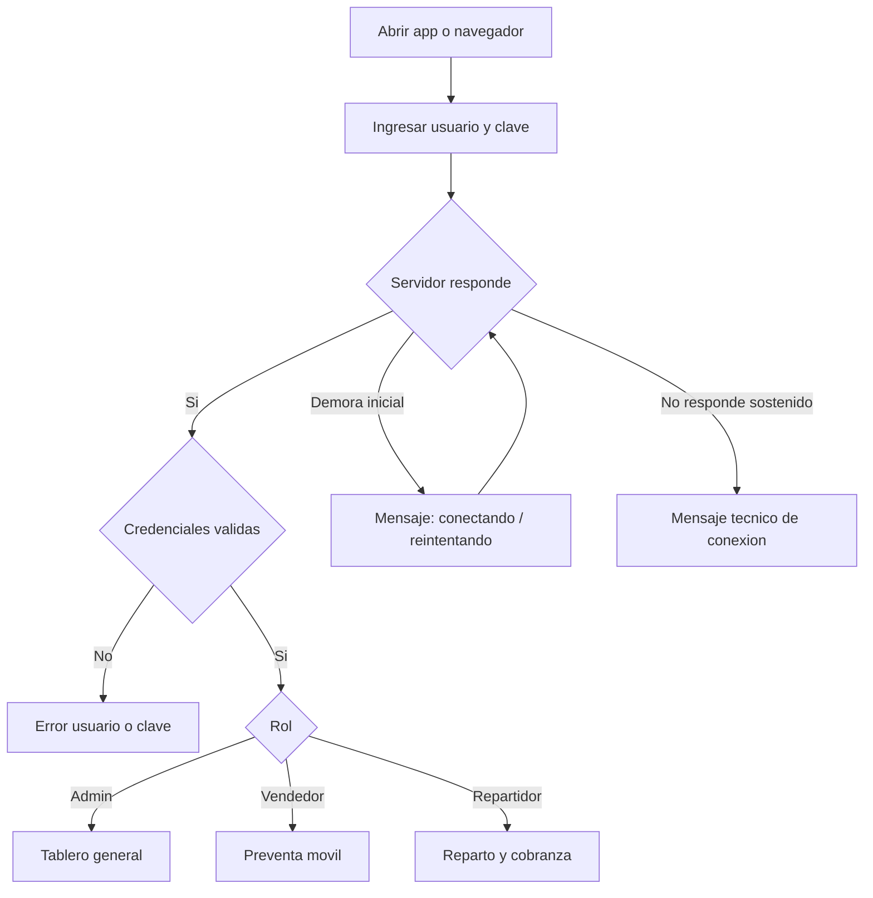

### Puntos de control

- Recupero de clave disponible.
- Soporte WhatsApp visible.
- Mensaje de conexion suavizado para evitar falsa alarma mientras inicia el servidor.

## Solapa: Tablero General

Estado: Implementado

### Objetivo

Dar una vision rapida de la operacion diaria.

### Muestra

- Ventas del dia.
- Saldos de clientes.
- Deuda proveedores.
- Stock critico.
- Pipeline de pedidos.
- Alertas operativas priorizadas.

### Flujo

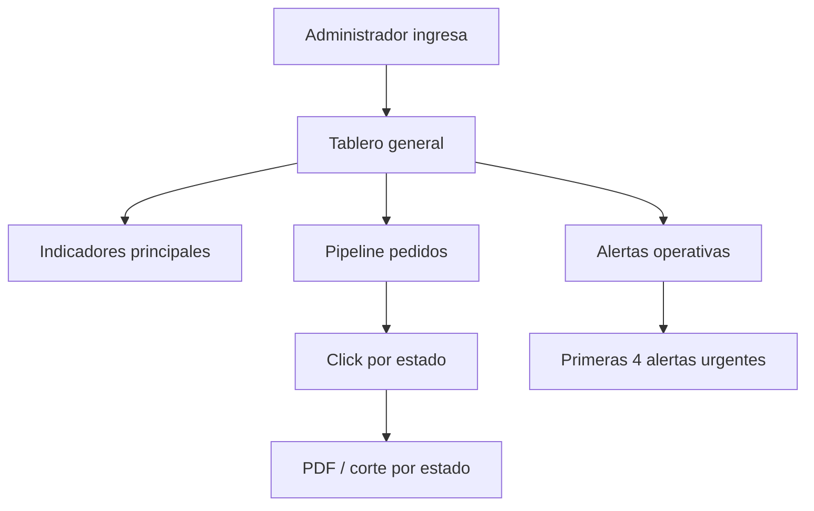

### Puntos de control

- Las alertas deben mostrar urgencias reales, no listas infinitas.
- El pipeline resume el estado del negocio sin entrar a cada solapa.

## Solapa: Preventa Movil

Estado: Implementado

### Objetivo

Permitir que vendedores carguen pedidos desde Android.

### Flujo actual

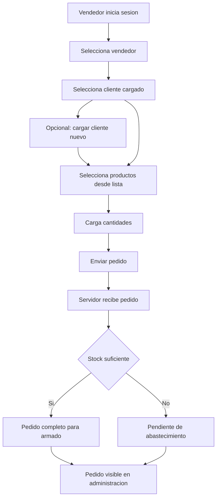

### Datos que toma

- Usuario vendedor.
- Cliente.
- Productos.
- Cantidades.
- GPS si la app tiene permiso y origen seguro.

### Puntos de control

- El producto debe salir del listado normalizado.
- El cliente debe estar cargado o darse de alta desde formulario.
- El GPS requiere APK o acceso seguro compatible.

## Solapa: Pedidos y Deposito

Estado: Implementado

### Objetivo

Gestionar vida del pedido desde preventa hasta despacho.

### Ciclo de pedido acordado

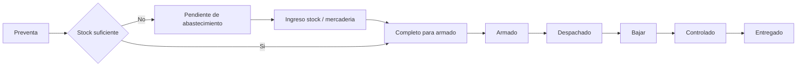

### Reglas

- No se modifica stock manualmente para vender mercaderia no ingresada.
- Si falta stock, el pedido queda registrado y genera faltantes.
- Al ingresar stock, el sistema intenta completar pedidos pendientes.
- Al despachar, se prepara para reparto.

### Puntos de control

- Los pedidos historicos migrados tienen tratamiento especial.
- Las reservas y faltantes evitan inventario ficticio.

## Solapa: Clientes

Estado: Implementado

### Objetivo

Administrar padron de clientes normalizado.

### Campos esperados

- Codigo cliente.
- Nombre comercial.
- Razon social.
- CUIT.
- Condicion fiscal.
- Domicilio.
- Localidad.
- Telefono.
- Forma de pago.
- Limite credito.
- Saldo inicial.
- Zona/ruta.
- Vendedor asignado.
- Estado.

### Flujo

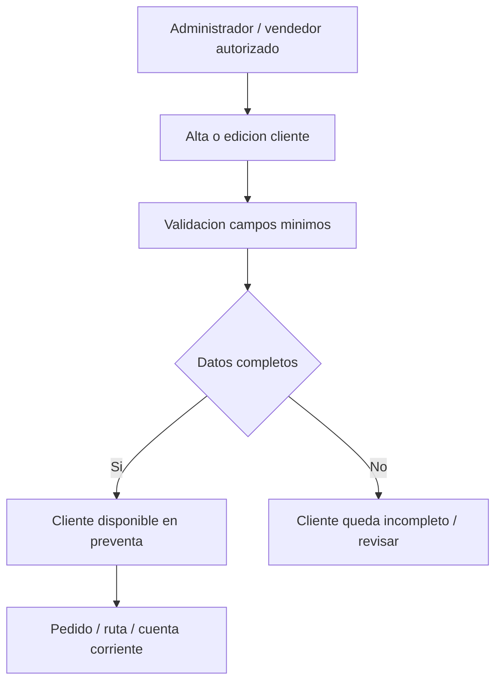

### Puntos de control

- Para rutas reales se necesita domicilio valido o coordenadas.
- Clientes sin direccion deben marcarse para completar datos.

## Solapa: Cuentas Corrientes

Estado: Implementado base

### Objetivo

Registrar saldos de clientes y movimientos de cobranza.

### Flujo

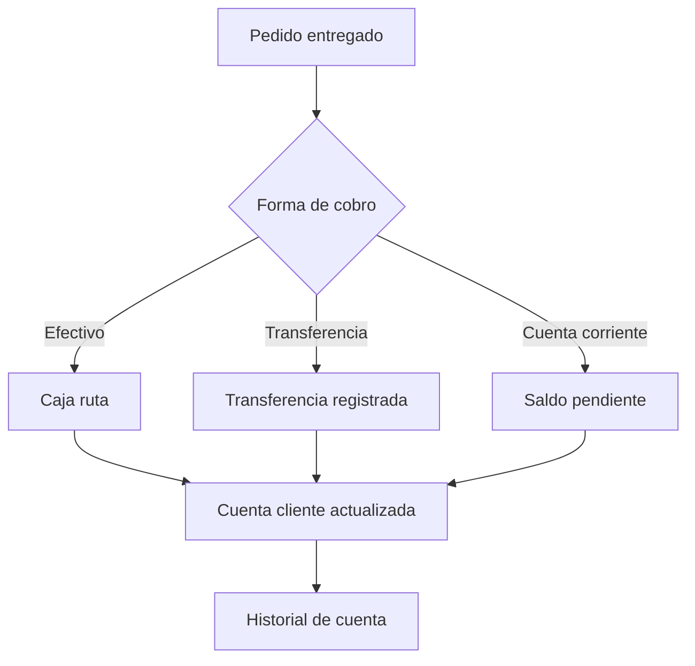

### Puntos de control

- La cuenta corriente debe actualizarse sin doble carga.
- En fase siguiente se debe profundizar conciliacion de cobranzas.

## Solapa: Stock y Compras

Estado: Implementado

### Objetivo

Controlar stock fisico, reservado, disponible, minimo y mercaderia en transito.

### Flujo

```mermaid
flowchart TD
  A["Carga stock / compra"] --> B{"Tipo movimiento"}
  B -->|"Ingreso fisico"| C["Aumenta stock fisico"]
  B -->|"Mercaderia en transito"| D["Aumenta transito"]
  B -->|"Ingreso desde transito"| E["Transito baja / fisico sube"]
  B -->|"Ajuste negativo"| F["Baja stock fisico"]
  C --> G["Recalcula disponible"]
  E --> G
  F --> G
  G --> H["Revisa pedidos pendientes"]
  H --> I{"Se completo pedido"}
  I -->|"Si"| J["Pasa a Completo para armado"]
  I -->|"No"| K["Sigue pendiente"]
```

### Funciones admin

- Busqueda de productos.
- Graficos de stock.
- Exportar CSV/PDF.
- Imprimir.
- Editar producto con revalidacion admin.

### Puntos de control

- No permitir bajar stock por debajo de reservas.
- Diferenciar fisico, reservado, disponible y transito.

## Solapa: Proveedores

Estado: Base implementada

### Objetivo

Registrar deuda y relacion con proveedores.

### Flujo base

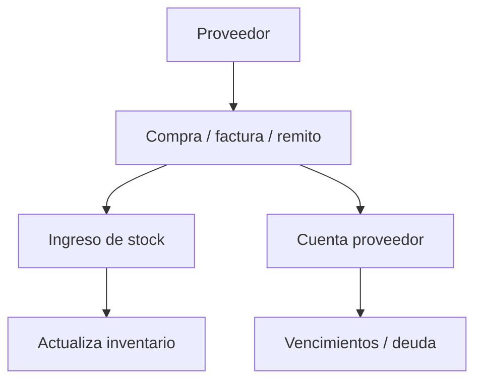

### Pendiente

- Factura/remito completo.
- Historial proveedor.
- Asociacion formal entre compra, ingreso y pago.

## Solapa: Reparto y Cobranza

Estado: En ajuste implementado

### Funcionamiento actual

Hoy el sistema genera rutas automaticamente cuando un pedido pasa a `Despachado`.

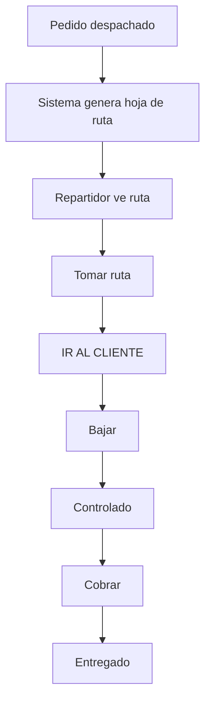

### Problema detectado

El cliente necesita que administracion arme rutas manualmente o semiautomaticamente antes de mandarlas al telefono.

### Flujo propuesto para validar

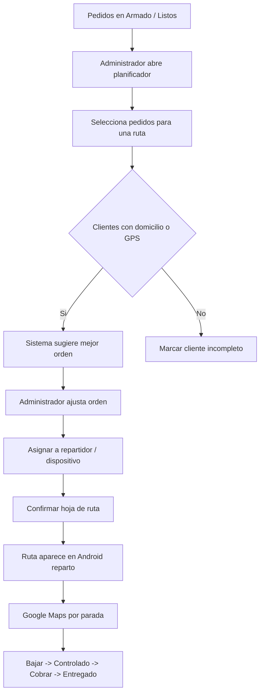

### Decision operativa adoptada

- La ruta se planifica con pedidos en `Armado`.
- La ruta se ejecuta cuando administracion publica el despacho y los pedidos pasan a `Despachado`.
- Administracion puede ajustar manualmente el orden sugerido.
- Los clientes sin domicilio ni GPS quedan marcados en rojo y no pueden publicarse a ruta hasta completar destino.

## Solapa: Rutas de Venta

Estado: Pendiente / propuesta

### Objetivo

Sugerir a vendedores una lista diaria de clientes a visitar, aunque no exista pedido previo.

### Flujo propuesto

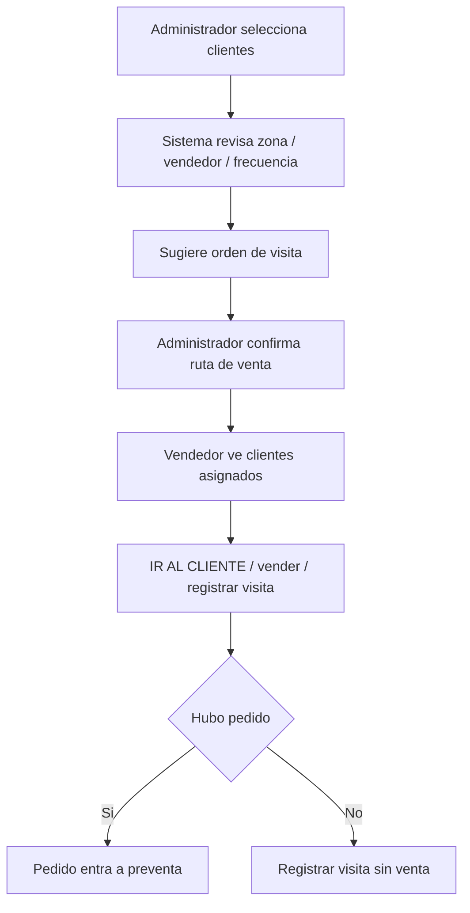

### Diferencia clave

- Ruta de reparto: parte de pedidos ya preparados.
- Ruta de venta: parte de clientes a visitar.

## Solapa: Estadisticas

Estado: Implementado base

### Objetivo

Mostrar consumo, tendencias y señales para reposicion.

### Flujo

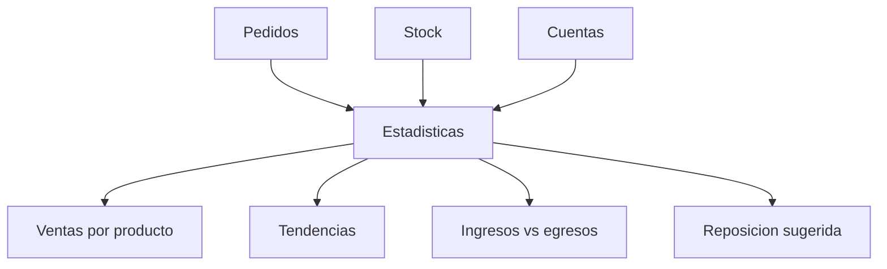

### Pendiente

- Estadistica avanzada de reposicion.
- Prediccion de stock.
- Ranking de clientes/productos por periodo.

## Solapa: Admin

Estado: Implementado base

### Objetivo

Configurar usuarios y operaciones de alto rango.

### Flujo

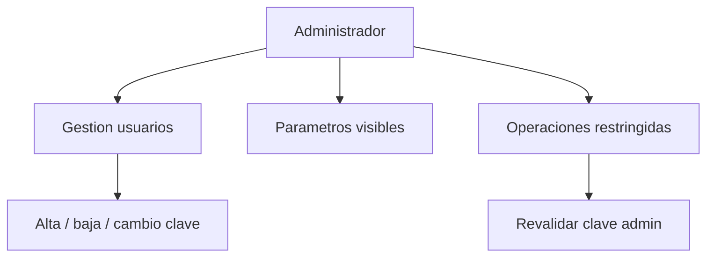

### Puntos de control

- Usuarios y claves no se editan a mano.
- Operaciones de alto rango deben pedir clave nuevamente.

## Herramienta Externa de Soporte

Estado: Implementado

### Objetivo

Permitir mantenimiento controlado sin exponer botones peligrosos dentro del sistema.

### Acceso

`SOPORTE-MANTENIMIENTO.cmd`

### Flujo

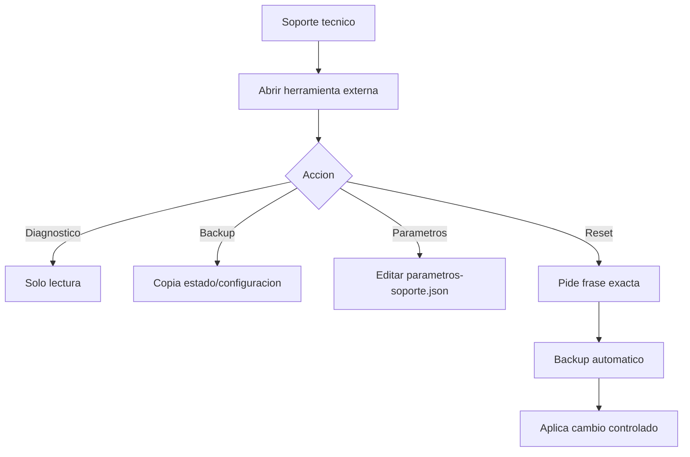

### Acciones disponibles

- Diagnostico.
- Backup manual.
- Exportar/aplicar parametros.
- Reset acumulados.
- Reset rutas.
- Reset GPS.
- Reset saldos clientes.

### Regla tecnica

No editar directamente:

`data\demo-state.json`

## Datos Criticos del Sistema

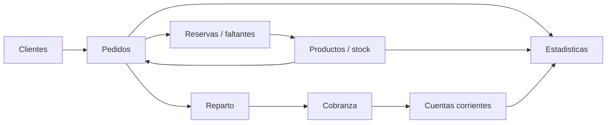

## Resumen para cliente

El sistema queda dividido en cuatro grandes circuitos:

1. Venta: vendedor carga pedido desde celular.
2. Stock: el sistema valida stock real, reserva o marca faltantes.
3. Deposito/Reparto: administracion y deposito preparan, despachan y entregan.
4. Cobranza/Control: se registra pago, saldo, GPS, firma y trazabilidad.

## Puntos a Definir Antes de la Siguiente Fase

1. Si la hoja de ruta se arma con pedidos en `Armado`, `Completo para armado` o `Despachado`.
2. Si una ruta puede mezclar reparto y cobranza o deben separarse.
3. Si los vendedores tambien tendran rutas de visita sin pedido.
4. Si clientes sin domicilio/GPS quedan bloqueados para ruta o solo marcados con alerta.
5. Si administracion podra cambiar manualmente el orden sugerido por el sistema.
6. Cuantos repartidores/dispositivos se usaran en simultaneo.
7. Si la ruta debe abrirse como lista de paradas en Google Maps o parada por parada.

## Recomendacion Tecnica

Implementar el siguiente ajuste:

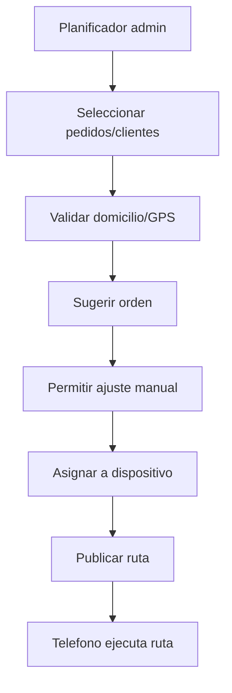

De esta forma el cliente controla la operacion, pero el sistema mantiene trazabilidad y evita ediciones manuales peligrosas.
