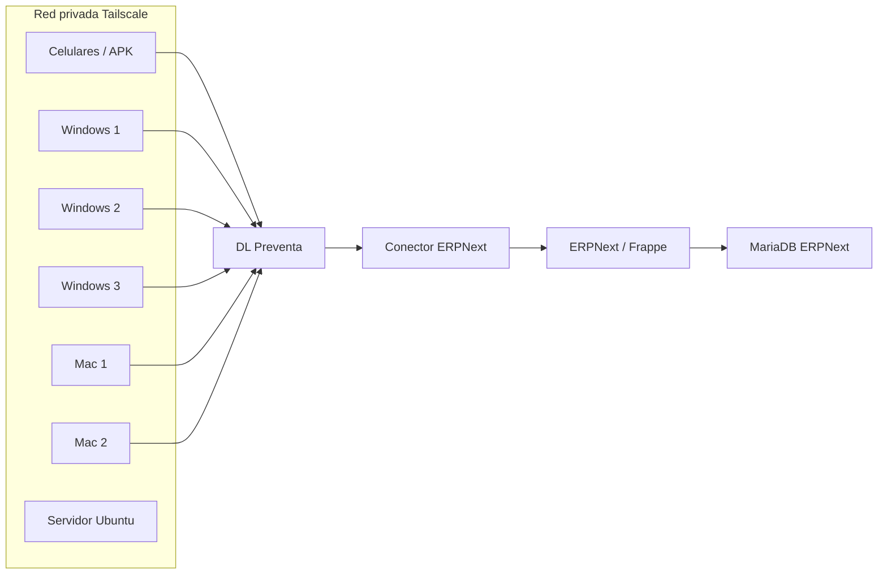

# Integracion ERPNext + DL Preventa

Fecha: 2026-07-05

## Decision tomada

Se frenan los prompts funcionales internos y se abre una fase nueva: integracion con ERPNext.

El objetivo no es reemplazar todo lo construido, sino ordenar roles:

- ERPNext: maestro administrativo, contable, clientes, articulos, stock formal, facturacion, compras y cuentas.
- DL Preventa: operacion rapida de preventa, deposito, etiquetas, reparto, GPS, cobranzas en calle y trazabilidad operativa.

## Red actual

- Servidor Ubuntu: sera el servidor ERPNext y/o el punto central de integracion.
- 5 computadoras cliente:
  - 3 Windows.
  - 2 Mac.
- Todas tienen Tailscale instalado.

La recomendacion inicial es no exponer ERPNext a internet publico hasta estabilizar la operatoria. Se accede por Tailscale.

## Arquitectura propuesta



## Integracion por etapas

### Etapa 0 - Infraestructura

1. Confirmar si ERPNext ya esta instalado en Ubuntu.
2. Confirmar URL Tailscale:
   - IP 100.x.x.x, o
   - MagicDNS tipo `servidor.tailnet.ts.net`.
3. Confirmar puerto:
   - desarrollo: `8000`,
   - produccion: `80/443`.
4. Crear usuario API en ERPNext.
5. Crear API Key y API Secret.

### Etapa 1 - Maestros

Sincronizar desde DL hacia ERPNext:

- Clientes -> `Customer`, `Address`, `Contact`.
- Productos -> `Item`.
- Codigos de barra -> campo barcode de Item o tabla de barcodes.
- Zonas/rutas -> campos custom o Territory.
- Vendedores -> Sales Person o User.

### Etapa 2 - Pedidos

Sincronizar:

- Pedido de preventa -> `Sales Order`.
- Estado pendiente de abastecimiento -> Sales Order con nota/estado custom.
- Listo para despacho -> Sales Order preparado para Delivery Note.
- Despachado/Entregado -> `Delivery Note`.

### Etapa 3 - Cobranza

Sincronizar:

- Efectivo -> `Payment Entry`.
- Transferencia -> `Payment Entry` con comprobante adjunto.
- Fiado/saldo pendiente -> deuda del cliente en ERPNext.

### Etapa 4 - Stock y compras

Sincronizar:

- Ingreso de mercaderia -> `Stock Entry`, `Purchase Receipt` o `Purchase Invoice`, segun decision contable.
- Faltantes de preventa -> `Material Request` o lista interna de reposicion.

### Etapa 5 - Facturacion ARCA

No se recomienda arrancar por facturacion electronica. Primero hay que estabilizar:

- clientes,
- productos,
- stock,
- pedidos,
- entrega,
- cobranza.

Despues se conecta facturacion electronica desde ERPNext.

## Sentido recomendado de datos

### ERPNext debe ser dueño de

- clientes oficiales,
- articulos oficiales,
- listas de precio,
- stock formal,
- impuestos,
- cuentas corrientes,
- facturas,
- compras,
- pagos definitivos.

### DL Preventa debe ser dueño de

- toma rapida de pedidos,
- GPS,
- trazabilidad operativa,
- etiquetas,
- rutas,
- fotos de comprobantes,
- evidencia de entrega,
- experiencia de preventista/repartidor.

## API tecnica

ERPNext corre sobre Frappe. Frappe expone API REST por DocType.

Ejemplos base:

- crear documento: `POST /api/resource/:doctype`
- leer documento: `GET /api/resource/:doctype/:name`
- actualizar documento: `PUT /api/resource/:doctype/:name`
- listar documentos: `GET /api/resource/:doctype`

La autenticacion recomendada para esta integracion es API Key + API Secret por header:

`Authorization: token API_KEY:API_SECRET`

## Variables necesarias

En el servidor DL Preventa:

```env
ERPNEXT_ENABLED=false
ERPNEXT_URL=http://servidor-ubuntu:8000
ERPNEXT_API_KEY=
ERPNEXT_API_SECRET=
ERPNEXT_COMPANY=Distribuidora Lopez
ERPNEXT_DEFAULT_WAREHOUSE=Deposito Principal - DL
ERPNEXT_PRICE_LIST=Standard Selling
ERPNEXT_CUSTOMER_GROUP=Comercial
ERPNEXT_TERRITORY=Cordoba
```

## Campos de trazabilidad sugeridos en ERPNext

Crear campos custom en ERPNext:

- `dl_external_id`
- `dl_order_code`
- `dl_source`
- `dl_seller`
- `dl_route`
- `dl_delivery_status`
- `dl_gps_lat`
- `dl_gps_lng`
- `dl_last_sync_at`

Esto permite idempotencia: si DL reintenta enviar un pedido, ERPNext no duplica.

## Primeras pruebas

1. Desde una PC con Tailscale:
   - abrir URL ERPNext.
2. Desde el servidor DL:
   - probar `GET /api/method/frappe.auth.get_logged_user`.
3. Enviar cliente de prueba.
4. Enviar item de prueba.
5. Enviar pedido de prueba como Draft Sales Order.
6. Verificar que no duplica si se reintenta.

## Datos que faltan

- URL o IP Tailscale del Ubuntu.
- Confirmacion de ERPNext instalado o no instalado.
- Usuario administrador ERPNext.
- API Key y API Secret de un usuario API.
- Nombre exacto de la compania en ERPNext.
- Deposito principal.
- Moneda y lista de precios.
- Si ERPNext debe recibir pedidos como Draft o Submit.
